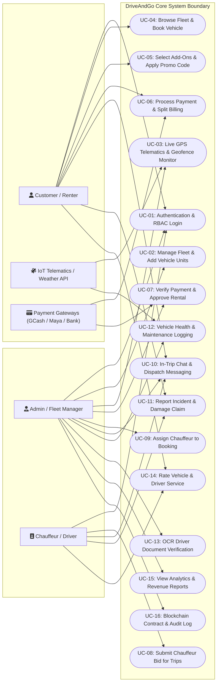
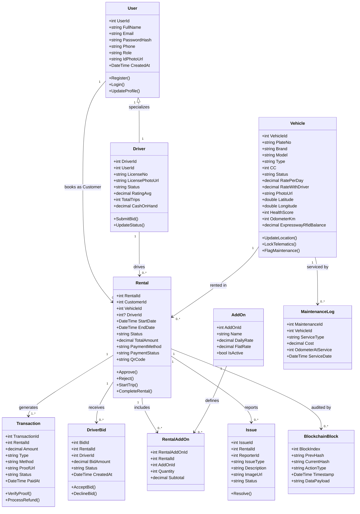
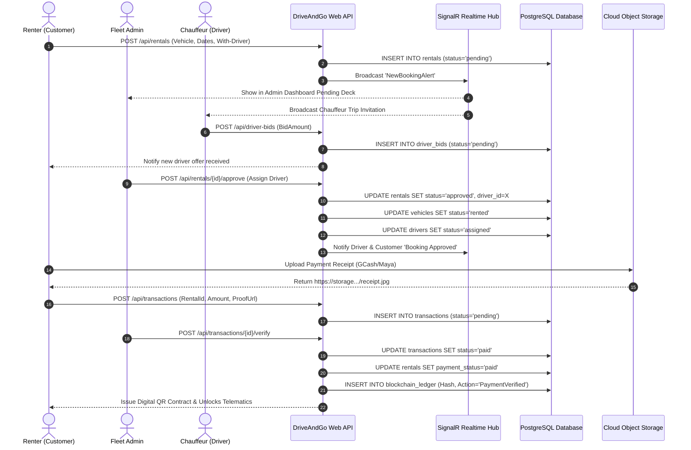
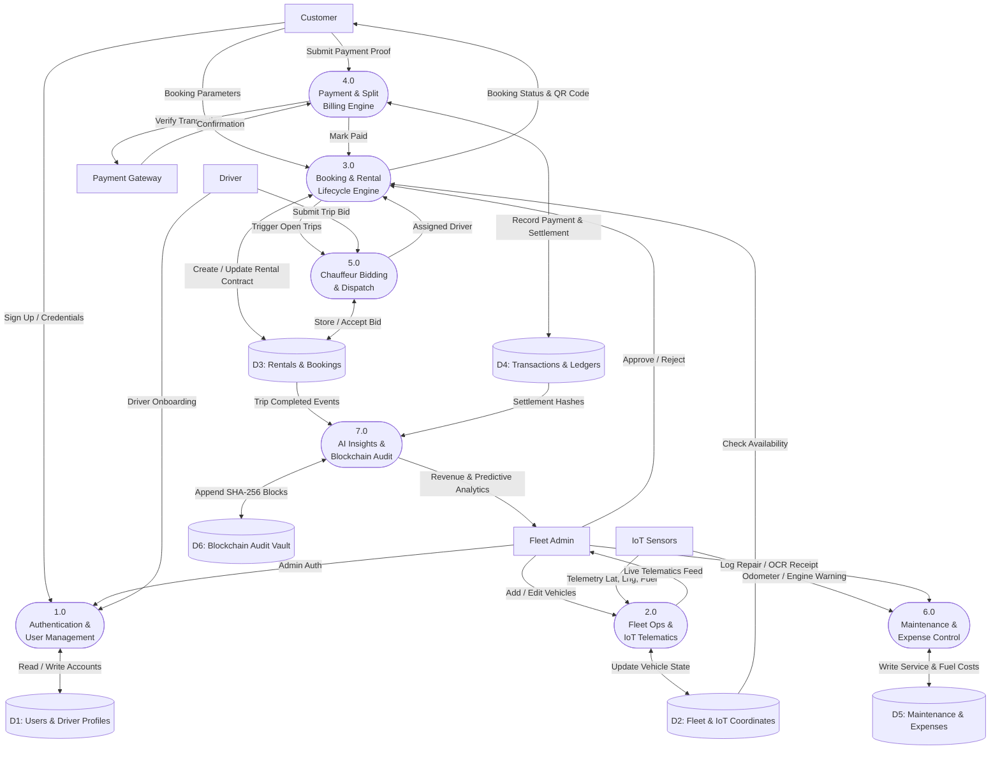
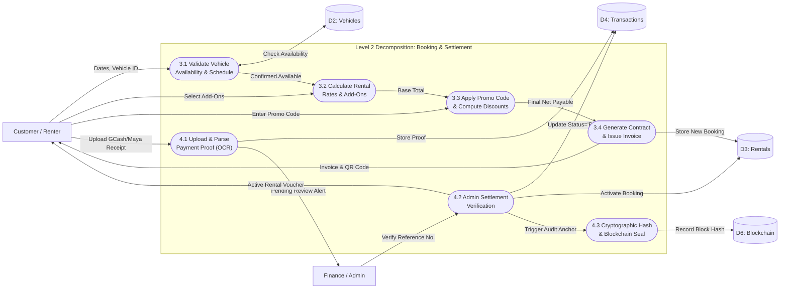

# DriveAndGo System Architecture & Technical Documentation
### Complete UML, ERD, and Data Flow Diagrams (DFD) for System Documentation & Thesis Defense

---

## Table of Contents
1. [Executive System Overview](#1-executive-system-overview)
2. [UML Use Case Diagram (Like Reference Sample)](#2-uml-use-case-diagram)
3. [UML Class Diagram (Domain Model & OOP Architecture)](#3-uml-class-diagram)
4. [UML Sequence Diagram (End-to-End Booking & Telematics Flow)](#4-uml-sequence-diagram)
5. [Complete Entity-Relationship Diagram (ERD)](#5-complete-entity-relationship-diagram-erd)
6. [Comprehensive Data Dictionary](#6-comprehensive-data-dictionary)
7. [Data Flow Diagrams (DFD)](#7-data-flow-diagrams-dfd)
   - [7.1 DFD Level 0: Context Diagram](#71-dfd-level-0-context-diagram)
   - [7.2 DFD Level 1: System Decomposition Diagram](#72-dfd-level-1-system-decomposition-diagram)
   - [7.3 DFD Level 2: Booking & Payment Subsystem](#73-dfd-level-2-booking--payment-subsystem)

---

## 1. Executive System Overview

**DriveAndGo** is an enterprise-grade car rental and fleet management ecosystem consisting of:
* **Admin Operations Center (Desktop & Web)**: WinForms/WebView2 hybrid React dashboard for real-time telematics, fleet assignment, revenue tracking, OCR document verification, dynamic pricing, and automated compliance.
* **Customer & Driver Mobile Application**: React Native mobile client for vehicle discovery, instant reservation, digital key check-in, in-trip GPS routing, driver bidding, split billing, and digital payment receipts.
* **Backend Web API Core**: .NET 10 ASP.NET Web API with PostgreSQL database, real-time SignalR hubs, JWT authentication, and multi-tier cloud storage.

---

## 2. UML Use Case Diagram

The diagram below reflects the standard industry use case modeling format (matching the reference template), detailing the functional boundaries of DriveAndGo and the interactions of its 4 primary actors:
* **Admin / Fleet Manager**
* **Customer / Renter**
* **Chauffeur / Driver**
* **External Systems (Payment Gateways, Weather & GPS Telematics)**

---

## 3. UML Class Diagram

This diagram showcases the Object-Oriented Domain Entities and their business logic associations in the C# .NET 10 API backend:

---

## 4. UML Sequence Diagram
### End-to-End Booking, Chauffeur Bidding, Telematics & Settlement

---

## 5. Complete Entity-Relationship Diagram (ERD)

This Crow's Foot ERD models all 23 database tables, their primary keys (`PK`), foreign keys (`FK`), and cardinalities across the complete operational database:

```mermaid
erDiagram
    USERS ||--o| DRIVERS : "has profile"
    USERS ||--o{ RENTALS : "books"
    USERS ||--o{ ISSUES : "reports"
    USERS ||--o{ NOTIFICATIONS : "receives"
    USERS ||--o{ MESSAGES : "sends"
    USERS ||--o{ RATINGS : "submits as customer"

    DRIVERS ||--o{ DRIVER_PAYOUT_ACCOUNTS : "owns"
    DRIVERS ||--o{ DRIVER_EMERGENCY_CONTACTS : "lists"
    DRIVERS ||--o{ DRIVER_DOCUMENTS : "submits"
    DRIVERS ||--o{ DRIVER_INCIDENTS : "penalized"
    DRIVERS ||--o{ DRIVER_BIDS : "places"
    DRIVERS ||--o{ RENTALS : "chauffeurs"
    DRIVERS ||--o{ RATINGS : "evaluated"

    VEHICLES ||--o{ RENTALS : "assigned to"
    VEHICLES ||--o{ MAINTENANCE_LOGS : "services"
    VEHICLES ||--o{ EXPENSES : "incurs"
    VEHICLES ||--o{ LOCATION_LOGS : "tracks"
    VEHICLES ||--o{ TOLL_LOGS : "crosses"
    VEHICLES ||--o{ RATINGS : "evaluated"

    RENTALS ||--o{ TRANSACTIONS : "bills"
    RENTALS ||--o{ RENTAL_ADD_ONS : "selects"
    RENTALS ||--o{ DRIVER_BIDS : "solicits"
    RENTALS ||--o{ EXTENSIONS : "extends"
    RENTALS ||--o{ ISSUES : "flags"
    RENTALS ||--o{ SPLIT_PAYMENTS : "splits"
    RENTALS ||--o{ MESSAGES : "contains"
    RENTALS ||--o{ RATINGS : "reviews"
    RENTALS ||--o{ BLOCKCHAIN_LEDGER : "audits"

    ADD_ONS ||--o{ RENTAL_ADD_ONS : "cataloged in"

    USERS {
        int user_id PK
        string full_name
        string email UK
        string password_hash
        string phone
        string role
        string id_photo_url
        string selfie_photo_url
        timestamptz created_at
    }

    DRIVERS {
        int driver_id PK
        int user_id FK
        string license_no UK
        string license_photo_url
        string status
        numeric rating_avg
        int total_trips
        numeric cash_on_hand
        string verification_status
    }

    VEHICLES {
        int vehicle_id PK
        string plate_no UK
        string brand
        string model
        string type
        int cc
        string status
        numeric rate_per_day
        numeric rate_with_driver
        string photo_url
        string color
        double latitude
        double longitude
        int odometer_km
        int health_score
        numeric expressway_rfid_balance
    }

    RENTALS {
        int rental_id PK
        int customer_id FK
        int vehicle_id FK
        int driver_id FK
        timestamptz start_date
        timestamptz end_date
        string destination
        string status
        numeric total_amount
        string payment_method
        string payment_status
        string qr_code
        timestamptz created_at
    }

    TRANSACTIONS {
        int transaction_id PK
        int rental_id FK
        numeric amount
        string type
        string method
        string proof_url
        string status
        timestamptz paid_at
    }

    ADD_ONS {
        int add_on_id PK
        string name
        numeric daily_rate
        numeric flat_rate
        boolean is_active
    }

    RENTAL_ADD_ONS {
        int rental_addon_id PK
        int rental_id FK
        int add_on_id FK
        int quantity
        numeric subtotal
    }

    DRIVER_BIDS {
        int bid_id PK
        int rental_id FK
        int driver_id FK
        numeric bid_amount
        string status
        timestamptz created_at
    }

    EXTENSIONS {
        int extension_id PK
        int rental_id FK
        int added_days
        numeric added_fee
        string status
        timestamptz requested_at
    }

    ISSUES {
        int issue_id PK
        int rental_id FK
        int reporter_id FK
        string issue_type
        text description
        string image_url
        string status
        timestamptz reported_at
    }

    MAINTENANCE_LOGS {
        int log_id PK
        int vehicle_id FK
        string service_type
        numeric cost
        int odometer_km
        timestamptz service_date
    }

    EXPENSES {
        int expense_id PK
        int vehicle_id FK
        string category
        numeric amount
        string receipt_url
        timestamptz incurred_at
    }

    SPLIT_PAYMENTS {
        int split_id PK
        int rental_id FK
        string payer_name
        string payer_phone
        numeric share_amount
        string status
    }

    BLOCKCHAIN_LEDGER {
        int block_id PK
        int block_index
        string prev_hash
        string current_hash
        int rental_id FK
        string action_type
        jsonb payload_data
        timestamptz timestamp
    }
```

---

## 6. Comprehensive Data Dictionary

| Table Name | Primary Key | Foreign Keys | Key Columns & Types | Description |
| :--- | :--- | :--- | :--- | :--- |
| **`users`** | `user_id` (SERIAL) | None | `email` (VARCHAR), `role` (VARCHAR), `password_hash` (TEXT) | System actors (Customers, Drivers, Admins, SuperAdmins). |
| **`drivers`** | `driver_id` (SERIAL) | `user_id` ➔ `users` | `license_no` (VARCHAR), `status` (VARCHAR), `rating_avg` (NUMERIC) | Professional chauffeur workforce profile & performance metrics. |
| **`driver_documents`**| `doc_id` (SERIAL) | `driver_id` ➔ `drivers` | `doc_type` (VARCHAR), `file_url` (TEXT), `status` (VARCHAR) | LTO license, NBI, police, drug test compliance vault. |
| **`vehicles`** | `vehicle_id` (SERIAL) | None | `plate_no` (VARCHAR), `brand` (VARCHAR), `rate_per_day` (NUMERIC), `status` (VARCHAR) | Fleet repository including IoT telematics coordinates, speed, and health score. |
| **`rentals`** | `rental_id` (SERIAL) | `customer_id`, `vehicle_id`, `driver_id` | `status` (VARCHAR), `total_amount` (NUMERIC), `start_date` (TIMESTAMPTZ) | Core business contract binding renter, vehicle, driver, and dates. |
| **`transactions`** | `transaction_id` (SERIAL)| `rental_id` ➔ `rentals` | `amount` (NUMERIC), `method` (VARCHAR), `proof_url` (TEXT), `status` (VARCHAR) | Financial audit records for payments, refunds, deposits, and extensions. |
| **`driver_bids`** | `bid_id` (SERIAL) | `rental_id`, `driver_id` | `bid_amount` (NUMERIC), `status` (VARCHAR) | Auction bidding records submitted by drivers for with-driver bookings. |
| **`add_ons`** | `add_on_id` (SERIAL) | None | `name` (VARCHAR), `daily_rate` (NUMERIC), `flat_rate` (NUMERIC) | Accessories catalog (GPS Navigator, Baby Seat, Luggage Rack). |
| **`rental_add_ons`** | `rental_addon_id` | `rental_id`, `add_on_id` | `quantity` (INT), `subtotal` (NUMERIC) | Line items of add-ons selected per rental reservation. |
| **`promo_codes`** | `promo_id` (SERIAL) | None | `code` (VARCHAR), `discount_type` (VARCHAR), `discount_value` (NUMERIC) | Discount coupons and promotional campaigns. |
| **`maintenance_logs`**| `log_id` (SERIAL) | `vehicle_id` ➔ `vehicles` | `service_type` (VARCHAR), `cost` (NUMERIC), `odometer_km` (INT) | Scheduled vehicle maintenance, oil changes, brake pads, and repairs. |
| **`expenses`** | `expense_id` (SERIAL) | `vehicle_id` ➔ `vehicles` | `category` (VARCHAR), `amount` (NUMERIC), `receipt_url` (TEXT) | Fleet operating costs (Fuel, Cleaning, Tolls, Emergency Repairs). |
| **`split_payments`** | `split_id` (SERIAL) | `rental_id` ➔ `rentals` | `payer_name` (VARCHAR), `share_amount` (NUMERIC), `status` (VARCHAR) | Peer-to-peer split billing records for group travel expenses. |
| **`issues`** | `issue_id` (SERIAL) | `rental_id`, `reporter_id` | `issue_type` (VARCHAR), `description` (TEXT), `image_url` (TEXT) | Road accidents, vehicle damage, flat tire, or engine issues. |
| **`blockchain_ledger`**| `block_id` (SERIAL) | `rental_id` ➔ `rentals` | `prev_hash` (TEXT), `current_hash` (TEXT), `action_type` (VARCHAR) | Immutable SHA-256 cryptographic chain preventing booking fraud. |

---

## 7. Data Flow Diagrams (DFD)

### 7.1 DFD Level 0: Context Diagram
The Level 0 Context Diagram establishes the highest-level view of information exchange between DriveAndGo and all external entities:

```mermaid
flowchart TD
    %% Entities
    Customer["fa:fa-user Customer / Renter"]
    Admin["fa:fa-user-tie Admin / Fleet Manager"]
    Driver["fa:fa-id-badge Chauffeur / Driver"]
    PaymentGateway["fa:fa-credit-card Payment Gateway\n(GCash / Maya / Bank)"]
    IoTTLS["fa:fa-satellite IoT Telematics &\nWeather Sensors"]

    %% Core System
    System(["0.0\nDriveAndGo Fleet &\nRental System"])

    %% Customer Flows
    Customer -->|"Registration & Login Credentials"| System
    Customer -->|"Reservation Requests & Destination"| System
    Customer -->|"Payment Proof & QR Codes"| System
    Customer -->|"Ratings & Incident Reports"| System
    System -->|"Available Fleet & Live Rates"| Customer
    System -->|"Digital Contract & Booking Confirmation"| Customer
    System -->|"Trip Status & In-App Messages"| Customer

    %% Admin Flows
    Admin -->|"Fleet Unit Configuration & Rates"| System
    Admin -->|"Booking Approval / Rejection Decisions"| System
    Admin -->|"Driver Compliance & Document Approval"| System
    Admin -->|"Geofence Boundary & Maintenance Orders"| System
    System -->|"Live Dashboard Telematics & Fleet Map"| Admin
    System -->|"Financial Ledger & Revenue Insights"| Admin
    System -->|"Critical Alerts (Engine, Flood, Overdue)"| Admin

    %% Driver Flows
    Driver -->|"License & Compliance Documents"| System
    Driver -->|"Trip Bids & Availability Status"| System
    Driver -->|"Mileage & Cash-on-Hand Reports"| System
    System -->|"Trip Assignment & Route Guidance"| Driver
    System -->|"Payout Statements & Passenger Details"| Driver

    %% External Systems
    IoTTLS -->|"GPS Lat/Lng, Speed, Fuel Level & Weather"| System
    System -->|"Remote Engine Lock / Telematics Command"| IoTTLS
    System -->|"Payment Verification Query"| PaymentGateway
    PaymentGateway -->|"Webhook Payment Settlement Confirmation"| System
```

---

### 7.2 DFD Level 1: System Decomposition Diagram
Decomposes the core system into seven major functional processes, showing the data repositories (Data Stores D1 to D6) utilized:

---

### 7.3 DFD Level 2: Booking & Payment Subsystem

A microscopic trace of how customer reservation requests flow through pricing, discount calculation, proof verification, and immutable ledger anchoring:

---

## 8. Summary & Capstone / Documentation Readiness

* **UML Use Case**: Fully outlines the user interactions and roles of all actors with system boundaries matching academic software engineering standards.
* **UML Class Diagram**: Maps out clean 1-to-Many and Object-Oriented inheritance between Users, Drivers, Fleet Vehicles, Contracts, and Bids.
* **UML Sequence Diagram**: Demonstrates synchronous & asynchronous events across WebSockets (SignalR), Controllers, and Cloud Storage.
* **ERD & Data Dictionary**: 100% accurate Crow's Foot ERD detailing all 23 database tables with data types, constraints, and relationships.
* **DFD Levels 0, 1, and 2**: Standard Gane & Sarson / Yourdon notation mapping the inputs, outputs, processes, and data stores of the entire platform.
